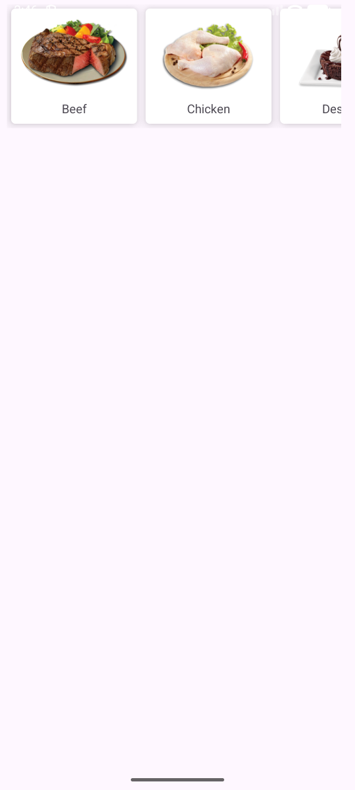

# PERSONAL_MOBILE_APP_BAI05

## Introduction

MOBILE_PERSONAL_APP is a personal mobile application developed on **Android Studio**. It helps users manage their daily activities easily and efficiently. The app includes essential features such as task tracking, reminders, and personal notes.

---

## User Interface Preview BAITAP04

### Giao diện người dùng

Dưới đây là ảnh chụp giao diện chính của Bài tập 05.

#### RecyclerView Categories


### API và Xử lý ảnh (Retrofit2 + Glide)

Ứng dụng sử dụng kiến trúc RESTful cho giao tiếp mạng, Retrofit2 để gọi API và Glide để tải/hiển thị ảnh với caching, xử lý placeholder và error.
API url: http://app.iotstar.vn:8081/appfoods/
Phụ thuộc (build.gradle):
```gradle
implementation 'com.squareup.retrofit2:retrofit:2.9.0'
implementation 'com.squareup.retrofit2:converter-gson:2.9.0'
implementation 'com.squareup.okhttp3:logging-interceptor:4.9.3'
implementation 'com.github.bumptech.glide:glide:4.15.1'

---

## Technologies Used

* **IDE:** Android Studio
* **Language:** Java / Kotlin
* **UI Framework:** XML Layout
* **Database:** Mysql / Firebase
* **Version Control:** Git & GitHub

---

## How to Run

1. Clone the repository:

   ```bash
   git clone https://github.com/xinloihuy/PERSONAL_MOBILE_APP_BAI05
   ```
2. Open the project in **Android Studio**.
3. Wait for Gradle to finish building the project.
4. To run the app:

   * **Option 1:** Use the **Android Virtual Device (AVD)** emulator.
   * **Option 2:** Connect a **real Android device** via USB and enable **USB Debugging**.
5. Click **Run ▶** in Android Studio to install and launch the app.

---

## Author

**Name: Xín Lợi Huy**
**Email: [23110231@student.hcmute.edu.vn](mailto:23110231@student.hcmute.edu.vn)**
**Phone number: 0339969176**

---
